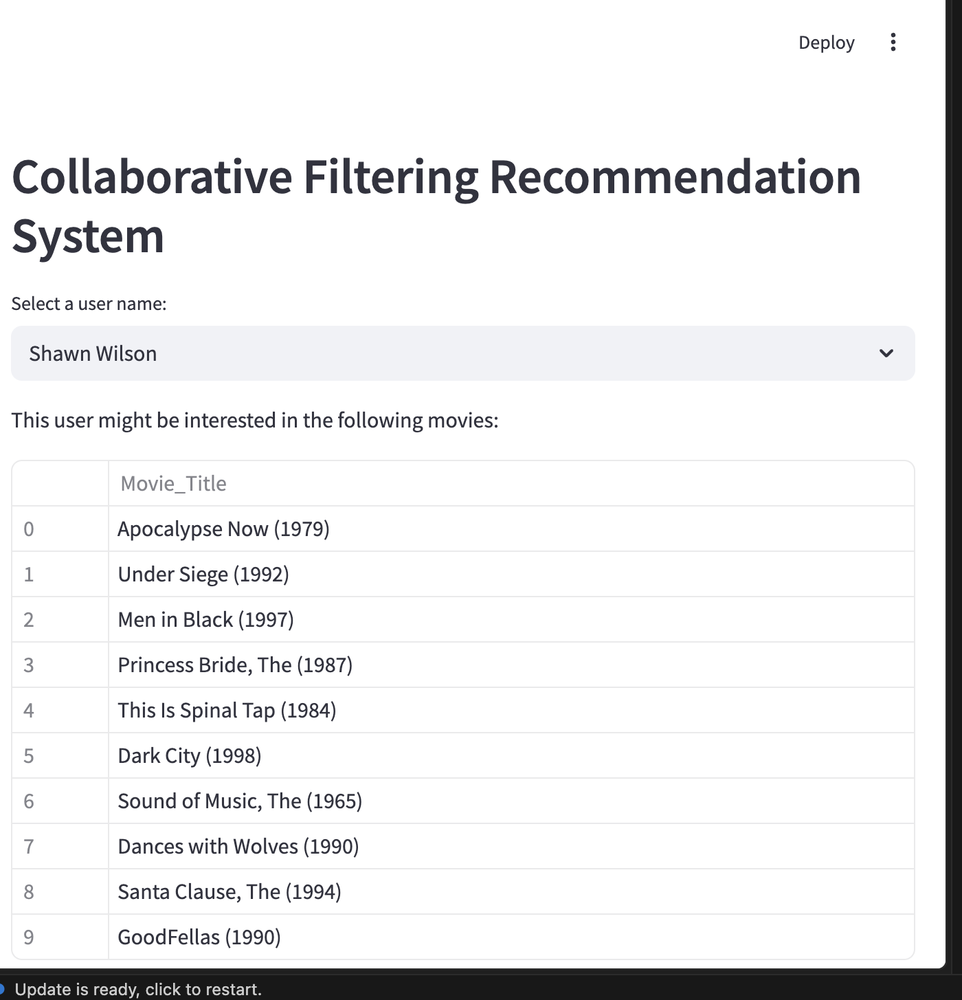

# Movie Recommendation System — Collaborative Filtering

A machine-learning-powered movie recommendation web app built with **Streamlit**. It uses **User-Based Collaborative Filtering** with cosine similarity to suggest movies a user is likely to enjoy, based on the rating patterns of similar users.

---

## Screenshot



---

## How It Works

1. **Load Data** — Ratings from `Movie_data.csv` are merged with movie titles from `Movie_Id_Titles.csv`.
2. **Build Interaction Matrix** — A 2D user × movie matrix is constructed where each cell holds a user's rating (0 if unrated).
3. **Compute Similarity** — Cosine similarity is calculated between every pair of users in the interaction matrix.
4. **Generate Recommendations** — For a selected user, the top-k most similar users are found. The movies they rated highly (but the selected user hasn't seen) are recommended.
5. **Streamlit UI** — Select any user from the dropdown and instantly view their personalised top-10 movie recommendations.

---

## Dataset

| File | Description |
|------|-------------|
| `Movie_data.csv` | 100,003 ratings by 944 users (columns: `User_ID`, `User_Names`, `Movie_ID`, `Rating`, `Timestamp`) |
| `Movie_Id_Titles.csv` | Mapping of 1,682 movie IDs to titles |

- Ratings are on a scale of **1–5**
- Dataset is based on the classic [MovieLens 100K](https://grouplens.org/datasets/movielens/100k/) dataset

---

## Project Structure

```
ml-filtering-recommendation-system/
├── app.py                      # Streamlit web application
├── CollaborativeFiltering.ipynb # Core ML logic (recommendation engine)
├── Movie_data.csv              # User ratings dataset
├── Movie_Id_Titles.csv         # Movie ID to title mapping
├── screenshots/
│   └── app_screenshot.png      # App UI screenshot
└── README.md
```

---

## Tech Stack

| Tool | Purpose |
|------|---------|
| Python 3.x | Core language |
| Streamlit | Web UI framework |
| Pandas | Data loading and manipulation |
| NumPy | Interaction matrix construction |
| scikit-learn | Cosine similarity computation |
| Plotly | (Available for rating charts) |
| ipynb | Import functions from Jupyter notebook |

---

## Installation & Setup

### Prerequisites
- Python 3.8 or higher
- pip

### 1. Clone the repository

```bash
git clone https://github.com/your-username/ml-filtering-recommendation-system.git
cd ml-filtering-recommendation-system
```

### 2. Install dependencies

```bash
pip install streamlit pandas numpy scikit-learn plotly ipynb
```

### 3. Run the app

```bash
streamlit run app.py
```

The app will open automatically in your browser at **http://localhost:8501**

---

## Usage

1. Open the app in your browser after running `streamlit run app.py`
2. Select a **user name** from the dropdown menu
3. The app instantly displays the top **10 personalised movie recommendations** for that user
4. Try different users to see how recommendations change based on individual rating history

---

## ML Algorithm Detail

### User-Based Collaborative Filtering

```
User A rated: Star Wars ★5, Titanic ★4, Matrix ★5
User B rated: Star Wars ★5, Titanic ★3, Matrix ★4  → similar to A

Recommendation for A: Movies B watched that A hasn't seen yet
```

**Steps:**
1. Build an `n_users × n_movies` rating matrix
2. Apply `cosine_similarity(ratings)` to get a `n_users × n_users` similarity matrix
3. For target user U, find the top-k most similar users
4. Average their ratings, filter out movies U already watched
5. Return the top-n highest-rated unseen movies as recommendations

---

## License

This project is for educational purposes as part of an AI/ML course.
